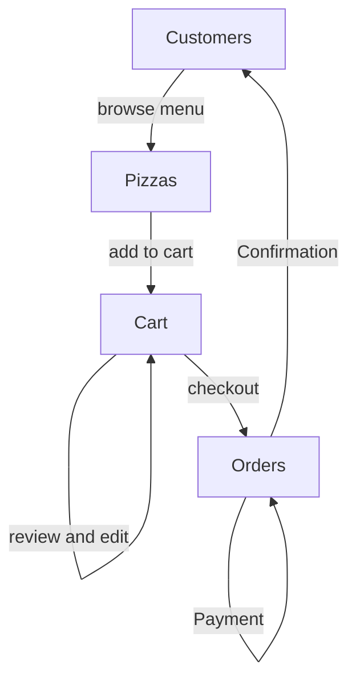

# sudoku-sandbox
Using sudoku puzzle to learn about backtracking algorithm, and Go.

## Summary
This is a simple Sudoku solver that I wrote as part of an interview one time.  The question was to create a solver 
that would take in a string map for the state of a Sudoku board. Once parsed the solver should be able to determine
if the board is valid. Valid meaning that of the currently populated values the board is valid in terms of the rows,
the columns, and the grids of nine.

## Usage
The code can be tested at the terminal by building and then running the code passing it a board state string. An 
example of a board state string is:

> "000260701680070090190004500820100040004602900050003028009300074040050036703018000"

You can see that this string represents every position in the puzzle, starting from top left corner and going
from left to right and top down. Where empty positions are represented by a "0" zero. This puzzle state string
can be passed to the method `Sudoku.ParseBoard()` and once the board is parsed you can pass the Sudoku object 
by reference to the solver package method `Solver.TrySolve(&sudokuBoard, row0, col0)` in order to have all of
the checks run on the board (row, col, grid).

## Improvements
One improvement I think, would definitely be to update the interface so that calling or interacting with the code 
would be easier. Perhaps a way to check only rows, cols, etc. or possibly more output about the results of the parsing
and validation.

